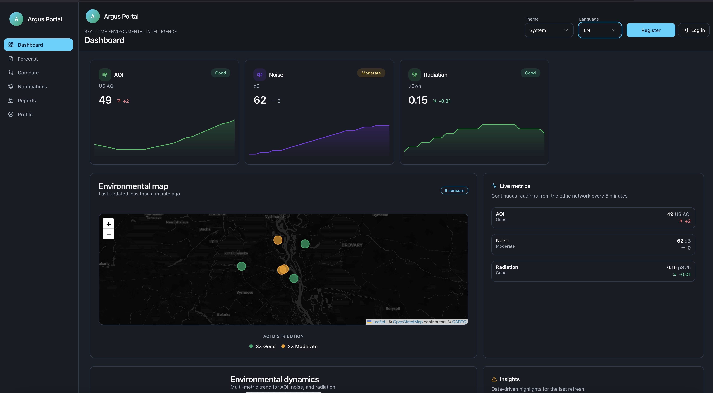
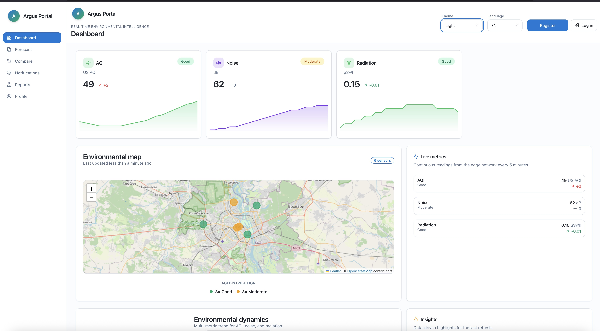

# Argus Portal MVP


Argus Portal is a React + Vite web application that visualises environmental sensor data for a global audience. The MVP includes a Leaflet map, KPI cards, realtime charts, device management UI, notifications list, and profile preferences with light/dark theme and EN/UA localisation.

---

### UI Screenshots

#### 🌙 Dark Theme


#### ☀️ Light Theme


---

### 🗺️ Basemap Providers

Argus Portal relies exclusively on **open and license-free map tiles**.  
No proprietary or paid map services (e.g., Stadia Maps, Mapbox, Google) are used.

| Mode | Provider | Tile URL | License |
|------|-----------|-----------|----------|
| **Light** | [OpenStreetMap](https://www.openstreetmap.org/copyright) | `https://{s}.tile.openstreetmap.org/{z}/{x}/{y}.png` | ODbL 1.0 |
| **Dark** | [CARTO Basemaps](https://carto.com/help/building-maps/basemap-list/) | `https://{s}.basemaps.cartocdn.com/dark_all/{z}/{x}/{y}.png` | Free for public/open use |

Both providers allow free, key-less access when attribution is displayed:  
`© OpenStreetMap contributors © CARTO`.

> This ensures Argus Portal remains 100 % open-data compliant and independent of any commercial tile API keys.

---

## Tech Stack

- React 19 with TypeScript and Vite
- Tailwind CSS + shadcn/ui design system components
- Leaflet + react-leaflet for mapping (OpenStreetMap tiles)
- Recharts for AQI trend visualisations
- react-i18next (EN/UA) with browser language detection
- @tanstack/react-query for client-side data access
- Docker (nginx) image for static hosting
- GitHub Actions for lint/build CI with artifact upload

## Getting Started

```bash
npm install
npm run dev
```

The dev server runs at [http://localhost:5173](http://localhost:5173). The map uses public OpenStreetMap tiles and does not require API keys.

### Available Scripts

- `npm run dev` – start the Vite development server
- `npm run build` – type-check and compile the production bundle to `dist/`
- `npm run preview` – serve the `dist/` bundle locally
- `npm run lint` – run ESLint with type-aware rules (`--max-warnings=0`)

## Features

- Light/Dark theme toggle with system preference bootstrap and localStorage persistence
- English/Ukrainian language switch powered by `react-i18next`
- Dashboard with KPI cards, Leaflet map (Kyiv) and AQI trend chart
- Devices page with status filter, shadcn/ui table, and “Add device” dialog (mock mutation)
- Notifications page with severity styling
- Profile page exposing theme, language, and live Keycloak session details
- Secure registration flow with client-side password hardening and policy consent
- World map view with 100 simulated European sensors for fast situational awareness
- Optional world map backend that serves hundreds of thousands of synthetic devices in real time

## Local Keycloak Stack

The repository ships with a secure-by-default Keycloak + Postgres stack for local development.

1. Copy the secrets template and adjust the values:

   ```bash
   cp .env.example .env
   # Update KC_DB_PASSWORD, KEYCLOAK_ADMIN_PASSWORD, etc.
   ```

2. Generate a self-signed TLS certificate (stored under `certs/keycloak/`):

   ```bash
   ./scripts/generate-keycloak-cert.sh
   ```

3. Start the services:

   ```bash
   docker compose up -d
   ```

4. Access the Keycloak admin console at [https://127.0.0.1:8443](https://127.0.0.1:8443) (accept the self-signed certificate). Sign in with the credentials defined in `.env`.

5. (Optional) Run `make keycloak-bootstrap` to create/update the default `argus-portal-web` client in the configured realm.

### Social identity providers

`make keycloak-bootstrap` automatically configures CORS/web origins for common local URLs (http/https on `localhost` and `127.0.0.1`), and it can also provision the social brokers exposed on the registration screen. Export the relevant credentials (or set them in your shell profile) before running the target:

```bash
export VITE_KEYCLOAK_REALM=argus
export VITE_KEYCLOAK_CLIENT_ID=argus-portal-web

export KEYCLOAK_IDP_GOOGLE_CLIENT_ID=xxx
export KEYCLOAK_IDP_GOOGLE_CLIENT_SECRET=xxx

export KEYCLOAK_IDP_GITHUB_CLIENT_ID=xxx
export KEYCLOAK_IDP_GITHUB_CLIENT_SECRET=xxx

export KEYCLOAK_IDP_MICROSOFT_CLIENT_ID=xxx
export KEYCLOAK_IDP_MICROSOFT_CLIENT_SECRET=xxx
# Optional: export KEYCLOAK_IDP_MICROSOFT_TENANT=<tenant-id-or-common>

export KEYCLOAK_IDP_APPLE_CLIENT_ID=xxx
export KEYCLOAK_IDP_APPLE_TEAM_ID=xxx
export KEYCLOAK_IDP_APPLE_KEY_ID=xxx
export KEYCLOAK_IDP_APPLE_PRIVATE_KEY="$(cat path/to/AuthKey_xxx.p8)"

export KEYCLOAK_IDP_FACEBOOK_CLIENT_ID=xxx
export KEYCLOAK_IDP_FACEBOOK_CLIENT_SECRET=xxx

export KEYCLOAK_IDP_INSTAGRAM_CLIENT_ID=xxx
export KEYCLOAK_IDP_INSTAGRAM_CLIENT_SECRET=xxx
# Optional overrides:
# export KEYCLOAK_IDP_INSTAGRAM_SCOPE="user_profile user_media"
# export KEYCLOAK_IDP_INSTAGRAM_AUTH_URL=https://api.instagram.com/oauth/authorize
# export KEYCLOAK_IDP_INSTAGRAM_TOKEN_URL=https://api.instagram.com/oauth/access_token
# export KEYCLOAK_IDP_INSTAGRAM_USERINFO_URL=https://graph.instagram.com/me?fields=id,username,account_type,name

export KEYCLOAK_IDP_TIKTOK_CLIENT_ID=xxx
export KEYCLOAK_IDP_TIKTOK_CLIENT_SECRET=xxx
# Optional overrides:
# export KEYCLOAK_IDP_TIKTOK_SCOPE="user.info.basic"
# export KEYCLOAK_IDP_TIKTOK_AUTH_URL=https://www.tiktok.com/v2/auth/authorize
# export KEYCLOAK_IDP_TIKTOK_TOKEN_URL=https://open.tiktokapis.com/v2/oauth/token
# export KEYCLOAK_IDP_TIKTOK_USERINFO_URL=https://open.tiktokapis.com/v2/user/info/

make keycloak-bootstrap
```

Any provider without the required credentials is skipped with a warning, so you can enable them incrementally.

### Cloudflare Turnstile

Provision an invisible Cloudflare Turnstile widget, then add `VITE_TURNSTILE_SITE_KEY` (and optionally `VITE_TURNSTILE_VERIFY_URL` if you proxy verification through your backend) to `.env.local`. Registration stays disabled until Turnstile returns a valid token.

### World Map Backend

The `server/` workspace hosts a Fastify-based data generator that streams hundreds of thousands of synthetic devices. Run it locally to test the full map flow:

```bash
npm run server
```

The service exposes `http://localhost:4000/api/sensors?bbox=` and `/api/summary`. Configure the frontend with `VITE_API_URL` to point at this server.

> **Note:** `make keycloak-up` now auto-generates `.env` with `admin` / `P@ssw0rd` for both Keycloak and Postgres and preconfigures permissive CORS headers (`KC_HTTP_RESPONSE_HEADER_ACCESS_CONTROL_*`). This is convenient for local development but must be replaced with strong secrets and locked-down origins before any shared deployment.
>
> The same command also creates `.env.local` with default Vite settings:
> ```
> VITE_KEYCLOAK_URL=https://127.0.0.1:8443
> VITE_KEYCLOAK_REALM=argus
> VITE_KEYCLOAK_CLIENT_ID=argus-portal-web
> VITE_TURNSTILE_SITE_KEY=
> VITE_TURNSTILE_VERIFY_URL=
> ```
> Ensure a matching public client exists in Keycloak for these values.

### Create the Argus Portal client

Inside Keycloak:

1. Create a new **public** client (e.g. `argus-portal-web`).
2. Set **Valid redirect URIs** to the frontend origins, e.g. `http://localhost:5173/*` and `https://127.0.0.1:8443/*` for silent SSO.
3. Enable **Web origins** (set to `*` during local development or explicitly list the dev origins).
4. Optional: configure default roles / groups for future RBAC.

### Frontend environment

Expose the Keycloak settings to Vite (dev or production) by creating `.env.local` (for Vite dev server) or `.env.production` (for `npm run build`):

```bash
VITE_KEYCLOAK_URL=https://127.0.0.1:8443
VITE_KEYCLOAK_REALM=argus
VITE_KEYCLOAK_CLIENT_ID=argus-portal-web
VITE_TURNSTILE_SITE_KEY=your-turnstile-site-key
VITE_TURNSTILE_VERIFY_URL=http://localhost:8787/api/turnstile/verify
VITE_API_URL=http://localhost:4000
```

Restart the dev server after updating env variables. When configured, the header exposes Log in / Log out actions and the Profile page renders live user metadata.

## Make Targets

Common project commands are wrapped in a `Makefile`:

```bash
make install        # npm install
make dev            # npm run dev
make lint           # npm run lint
make build          # npm run build
make keycloak-cert  # Generate local TLS certificates
make compose-up     # Start Keycloak + Postgres
make compose-down   # Stop the stack
make compose-logs   # Tail stack logs
make docker-run     # Build + run the nginx production image (ports 8080->80)
```

## Docker Image

Build and run the production container locally:

```bash
docker build -t argus-portal .
docker run -p 8080:80 argus-portal
```

The Nginx container serves the Vite `dist/` assets and rewrites unknown routes to `/index.html`.

## Continuous Integration

`.github/workflows/ci.yml` installs dependencies with `npm ci`, runs `npm run lint` and `npm run build`, then uploads the production bundle as a build artifact. The workflow triggers on pushes and pull requests targeting `main`.

## Internationalisation

Translation resources live in `src/i18n/en.json` and `src/i18n/uk.json`. Update both files when adding UI copy. Language choice is stored in `localStorage` and initialised from the browser locale.

## Theme System

`ThemeProvider` (see `src/hooks/useTheme.tsx`) syncs the DOM `classList` with the selected mode (`light`, `dark`, or `system`). Tailwind CSS consumes CSS variables defined in `src/index.css` to restyle shadcn/ui components automatically.

## Mock Data Layer

React Query hooks in `src/hooks/useDashboardData.ts` provide static KPI, device, and notification data with lightweight async simulation. The `useAddDevice` mutation updates the in-memory device list and revalidates cached queries.
